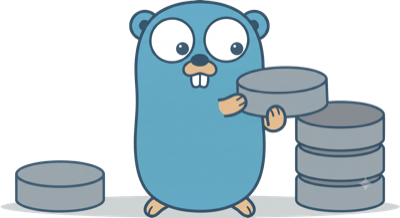

# KVM Converter Utilities (kc-utils)

Converts virtual machines disks from VMware, Xen, VirtualBox, Parallels, Hyper-V, EC2,
Nutanix AHV, and other disk-based sources to run on KVM with virtio drivers.
The core pipeline is four pure-Go binaries that inspect and mount guest disks,
convert the guest OS (Linux or Windows), then unmount, validate filesystems, and
emit JSON metadata for creating the target VM.

kc-utils are a pure Go re-implementation of [virt-v2v-in-place](https://libguestfs.org/virt-v2v-in-place.1.html);
see also [virt-v2v](https://libguestfs.org/virt-v2v.1.html).

- Disk copying from VMware uses pure Go
  [govmomi](https://github.com/vmware/govmomi) NFC export to stream VMDK files
  directly into target PVCs (no VDDK or nbdkit required).
- Guest filesystem operations can run rootless via the
  [libguestfs](https://libguestfs.org/) appliance, driven by the `guestfish`
  CLI: a minimal QEMU appliance VM mounts the guest disks internally, so no
  host root or `CAP_SYS_ADMIN` is required.

<p align="center">
  <br>
  
  <br><br>
</p>

**[Benchmark](docs/ref-baseline/README.md)** :
On OpenShift MTV cold migrations, kc-v2v matches or beats virt-v2v wall time
(about 3 minutes faster on RHEL, similar on Windows) while using less peak
memory and far less peak CPU, and transferring roughly 56–64 % less network
data by converting disks in-pod instead of a separate DiskTransferV2v stream.

**[Dashboard](https://htmlpreview.github.io/?https://github.com/yaacov/kc-utils/blob/main/docs/ref-baseline/dashboard.html)**
([source](docs/ref-baseline/dashboard.html)):
Interactive charts of memory, CPU, and network I/O over time for the ref vs
kc-v2v runs.

Two guest access modes are supported (see [docs/privilege-model.md](docs/privilege-model.md)):

- **host-mount** (default) - mounts guest filesystems with `mount(8)` and runs
  guest tools via `chroot` into that tree; requires root or `CAP_SYS_ADMIN`.
- **guestfs** (`-guestfs`) - runs a minimal [libguestfs](https://libguestfs.org/)
  appliance VM via `guestfish` (needs `/dev/kvm`); guest disks are accessed
  inside the appliance, so no host root is required.

## Forklift (MTV) Integration

kc-v2v is a drop-in replacement for the virt-v2v conversion image in
[Forklift](https://github.com/kubev2v/forklift). Configure it with:

```bash
oc mtv settings set --setting virt_v2v_image_fqin \
  --value quay.io/yaacov/kc-v2v:devel-amd64
```

See [docs/forklift-usage.md](docs/forklift-usage.md) for full usage instructions.

## Design Highlights

- **Pure Go core pipeline** - builds with standard `go build`, no C toolchain
  required. All binaries target Linux (`GOOS=linux`).
- **Initramfs rebuild via guest tools** - virtio drivers are injected by running
  the guest's own `dracut` (or `update-initramfs`/`mkinitramfs` on Debian) via
  `chroot` into the mounted guest root, with automatic fallback between methods.
- **Windows offline driver injection** - virtio drivers are registered in the
  Windows registry (`CriticalDeviceDatabase` / `DriverDatabase`) offline, making
  the guest bootable on KVM. Firstboot PowerShell scripts then complete driver
  installation via `pnputil` and install the QEMU guest agent.
- **ARM / aarch64 support** - cross-architecture conversion works out of the box.
  `kc-copy` uses pure Go (govmomi NFC), so it runs on any architecture.
- **Pluggable architecture** - Go interfaces with a generic `Registry[K,V]` and
  `init()` self-registration. Add a new hypervisor or distro by dropping a file
  into `pkg/<utility>/<block>/plugins/`.

## Architecture

The core pipeline is four binaries executed in sequence by an external
orchestrator (`kc-v2v`, a shell script, etc.):

| Binary | Purpose |
|----|-----|
| `kc-prepare` | Open disks, inspect guest OS, mount filesystems, collect metadata |
| `kc-convert-linux` | Convert Linux guests: remove hypervisor tools, inject virtio, fix bootloader |
| `kc-convert-windows` | Convert Windows guests: install virtio-win drivers, update registry, firstboot scripts |
| `kc-finalize` | Unmount, trim, fsck, assign bus slots, determine firmware, emit TargetMeta JSON |
| `kc-v2v` | V2V orchestrator for Forklift: runs the pipeline + inspection HTTP (optional NFC disk copy for blank PVCs) |
| `kc-copy` | NFC disk copy stage via govmomi (spawned by `kc-v2v`; also usable standalone) |

All kc-utils binaries require Linux (`//go:build linux` / `GOOS=linux`).

Inter-app communication uses JSON files written to a shared directory, plus a
shared mount point where the guest root filesystem is mounted.

## Develop

See [community/CONTRIBUTING.md](community/CONTRIBUTING.md) for directory layout,
dependencies, build, test, and PR guidance.

## Documentation

- [community/architecture.md](community/architecture.md) - Design principles for contributors and agents
- [community/CONTRIBUTING.md](community/CONTRIBUTING.md) - Build, test, layout, and dependencies
- [community/commits.md](community/commits.md) - Commit subject and message body conventions
- [community/pull-requests.md](community/pull-requests.md) - Branch naming and PR writing guidelines
- [community/code-review.md](community/code-review.md) - Code review priorities and report shape
- [docs/README.md](docs/README.md) - Complete conversion flow
- [docs/kc-v2v.md](docs/kc-v2v.md) - V2V orchestrator (Forklift conversion pod)
- [docs/kc-copy.md](docs/kc-copy.md) - NFC disk copy stage CLI
- [pkg/v2v/README.md](pkg/v2v/README.md) - kc-v2v libraries (copy, vsphere, env, inspection)
- [build/kc-v2v/README.md](build/kc-v2v/README.md) - Container image, Forklift Plan config
- [docs/forklift-usage.md](docs/forklift-usage.md) - Using kc-v2v with Forklift (MTV)
- [docs/privilege-model.md](docs/privilege-model.md) - Privilege model: host-mount vs guestfish / libguestfs appliance
- [docs/guest-os-handlers.md](docs/guest-os-handlers.md) - Linux distro and Windows version classification, special cases, and code map
- [docs/examples/](docs/examples/README.md) - JSON samples and runnable example
- [docs/kc-prepare.md](docs/kc-prepare.md) - kc-prepare pipeline
- [docs/kc-convert-linux.md](docs/kc-convert-linux.md) - Linux converter pipeline
- [docs/kc-convert-windows.md](docs/kc-convert-windows.md) - Windows converter pipeline
- [docs/kc-finalize.md](docs/kc-finalize.md) - kc-finalize pipeline

## License

This project is licensed under the [GNU General Public License v3.0](LICENSE).
