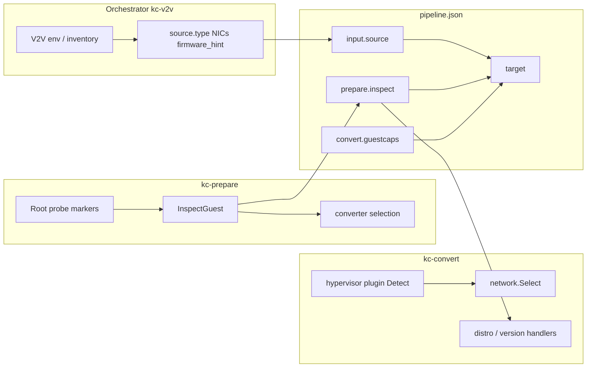

# Conversion dimension handling

kc-utils must clean up artifacts left by the **source hypervisor** and install
drivers and agents so the guest boots on **KubeVirt/KVM**. Those two concerns
depend on different classification axes that are identified at different times
and only partly persisted between pipeline stages.

This document explains how kc-utils handles that complexity:

- **(a)** how and when each dimension is identified
- **(b)** what is stored in `pipeline.json` between stages
- **(c)** how and when each stage consumes the information

For per-plugin cleanup and install matrices, see
[conversion-paths.md](conversion-paths.md). For handler/plugin detail, see
[guest-os-handlers.md](guest-os-handlers.md).

**Scope:** guest-side dimensions only. kc-utils does not detect or branch on
OpenShift cluster version or cluster CNI (OVN/SDN). MTV/Forklift owns
infrastructure-level network mapping (`network_map` is pass-through JSON).

---

## Overview

Four mostly independent axes drive conversion behavior:

| Axis | Drives primarily | Identified | Persisted in JSON? |
|------|------------------|------------|-------------------|
| Source hypervisor | **Cleanup** — remove old HV tools, services, drivers | Convert stage (in-guest artifacts) | Metadata (`source.type`) + in-guest outcomes (`convert.hypervisor`) |
| Guest OS (linux/windows) | **Which converter** + broad install path | `kc-prepare` | Yes (`prepare.inspect`, `prepare.converter`) |
| Guest OS version | **Install** — packages, drivers, firstboot scripts | `kc-prepare` | Yes (`prepare.inspect`, `prepare.inspect_windows`) |
| Guest network stack | **Networking install** (Linux only) | `kc-convert-linux` | Yes (`convert.network`) |

Two concern types cut across those axes:

- **Cleanup** — depends on which hypervisor software is installed *inside the
  guest*, not on orchestrator metadata alone.
- **Install** — depends on guest OS, version, and (on Linux) in-guest network
  stack.

Pipeline flow:

```text
kc-v2v  →  kc-prepare  →  kc-convert-linux|windows  →  kc-finalize
              │                      │
              └──── pipeline.json accumulates stage outputs ────┘
```

The shared envelope is [`PipelineData`](../../pkg/common/types/types.go). Each
stage reads `pipeline.json`, appends its section, and writes the file back.
See [`pkg/common/types/README.md`](../../pkg/common/types/README.md) for struct
definitions.

### Critical decouplings

1. **`input.source.type` does not select hypervisor cleanup.** Cleanup plugins
   call `Detect()` on the mounted guest filesystem or registry. A disk import
   with `source.type: "disk"` still gets VMware cleanup if open-vm-tools is
   present. Conversely, `source.type: "vsphere"` does not force any cleanup
   plugin — only artifacts found in the guest matter.

2. **Cleanup and install are independent.** A RHEL 9 VM from VMware needs
   VMware cleanup *and* RHEL 9 install steps. Those paths do not share a single
   classifier; they use different axes at different times. See
   [conversion-paths.md](conversion-paths.md).



---

## (a) How and when we identify each dimension

### Source hypervisor

Hypervisor handling has **two layers** that serve different purposes.

| Layer | When | How | Code |
|-------|------|-----|------|
| Orchestrator metadata | Before `kc-prepare` (`kc-v2v`) | `V2V_SOURCE` → `NormalizeSourceType()`; vSphere inventory adds NICs and firmware hint | [`pkg/v2v/env/build.go`](../../pkg/v2v/env/build.go), [`pkg/v2v/env/sourcemeta.go`](../../pkg/v2v/env/sourcemeta.go) |
| In-guest artifacts | `kc-convert-*` (Linux block 11; Windows blocks 4 and 8) | Each hypervisor plugin `Detect()` on mount root — paths, systemd units, registry keys | [`pkg/convert-linux/hypervisor/`](../../pkg/convert-linux/hypervisor/), [`pkg/convert-windows/hypervisor/`](../../pkg/convert-windows/hypervisor/) |

**Orchestrator metadata** normalizes source types to values such as `vsphere`,
`vmware`, `ec2`, `hyperv`, `ova`, `nutanix`, or `disk` (default when unset).
`vmware` is accepted as a vSphere migration source alongside `vsphere` (see
`IsVSphereSource`). For
vSphere, vCenter inventory can populate `source.nics` and `source.firmware_hint`.

**In-guest detection** iterates all registered cleanup plugins. Multiple
plugins may match on the same guest (for example VMware tools plus legacy kudzu
on an old RHEL VM). Each matching plugin runs its own `Cleanup()` or `Remove()`.

Supported cleanup plugins include VMware, Hyper-V, EC2, Citrix/Xen, Nutanix,
Parallels, VirtualBox, and Xen on Linux; VMware, Hyper-V, EC2, Citrix, Nutanix,
VirtualBox, and Parallels on Windows. See
[conversion-paths-linux.md](conversion-paths-linux.md) and
[conversion-paths-windows.md](conversion-paths-windows.md) for per-plugin
actions.

### Guest OS (linux vs windows)

| When | Stage | Signals |
|------|-------|---------|
| Root discovery probe | `kc-prepare` (before full mount) | [`inspect.ProbeRoot`](../../pkg/prepare/inspect/probe.go) — Linux: `etc/os-release` markers; Windows: `Windows/System32` |
| Full inspection | `kc-prepare` (after mount) | [`inspect.InspectGuest`](../../pkg/prepare/inspect/inspect.go) sets `inspect.type` to `linux` or `windows` |
| Converter selection | End of `kc-prepare` | [`converter.Select`](../../pkg/prepare/converter/) → `prepare.converter` = `kc-convert-linux` or `kc-convert-windows` |

Guest OS type is identified **once** in prepare and not re-detected in later
stages.

### Guest OS version

Identified in the same prepare inspect pass as guest OS type. Not re-detected
during convert or finalize.

**Linux** — [`inspect_linux_guest.go`](../../pkg/prepare/inspect/inspect_linux_guest.go):

- Reads `/etc/os-release` or `/usr/lib/os-release`
- `ID` → `inspect.distro` (for example `rhel`, `debian`, `amzn`)
- `VERSION_ID` → `inspect.major_version` / `inspect.minor_version`
- `PRETTY_NAME` → `inspect.product_name`
- Arch from `/lib/modules` kernel directory names when not set earlier

**Windows** — [`inspect_windows_guest.go`](../../pkg/prepare/inspect/inspect_windows_guest.go):

- Registry under `Microsoft\Windows NT\CurrentVersion` → product name and major
  version in `inspect`
- `prepare.inspect_windows` records hive paths, current control set, and drive
  mappings for convert-stage registry access

**Convert consumption:**

| OS | Classifier | Registry |
|----|------------|----------|
| Linux | First matching `DistroHandler.Matches(&inspect)` | [`pkg/convert-linux/distro/`](../../pkg/convert-linux/distro/) |
| Linux (parallel) | `distro.Format()` / `distro.Name()` from raw `inspect.distro` | Same package |
| Windows | `version.Classify(&inspect)` — first match in registration order | [`pkg/convert-windows/version/`](../../pkg/convert-windows/version/) |

See [guest-os-handlers.md](guest-os-handlers.md) for handler tables and special
cases (Amazon Linux guest agent, Windows driver OS directory preferences, etc.).

### Guest network stack

**Linux only** — detected at convert time, immediately after hypervisor
cleanup:

```text
kc-convert-linux block 11  →  hypervisor cleanup plugins
                          →  network.Select()  →  one NetworkHandler
```

[`network.Select()`](../../pkg/convert-linux/network/network.go) picks exactly
one registered handler by active network stack. The `networkd` handler
([`networkd.Detect()`](../../pkg/convert-linux/network/networkd/networkd.go))
matches when the guest uses **systemd-networkd** as its primary stack:

- `usr/lib/systemd/network/80-ec2.network` exists (EC2 cloud-init pattern)
- Guest is Amazon Linux 2023 (unless both networkd and NetworkManager are enabled)
- systemd-networkd is enabled and NetworkManager is masked or absent

When no handler matches, the `default` handler runs: NetworkManager or legacy
(ifupdown, etc.) static IP and NIC naming via firstboot.

**Windows** — no networkd fork. Static IP script style is chosen by the
Windows version handler ([`pkg/convert-windows/staticip`](../../pkg/convert-windows/staticip/)):
PowerShell `New-NetIPAddress`, registry-based config, or WMI depending on
Windows era.

---

## (b) What we store between stages

All cross-stage state lives in `pipeline.json` under the workdir (default
`/var/tmp/v2v/`). `kc-v2v` also writes `prepare-input.json` before the first
stage; subsequent stages read and update `pipeline.json`.

### Persistence table

| Data | JSON path | Written by | Read by | Persisted? |
|------|-----------|------------|---------|------------|
| Orchestrator source hypervisor | `input.source` (copied to `prepare.source`) | `kc-v2v`, `kc-prepare` | `kc-v2v` (copy), `kc-finalize` (NICs) | Yes |
| MTV network name mapping | `input.network_map` | `kc-v2v` | Pass-through only — no in-guest consumer | Yes (pass-through) |
| Guest OS + version | `prepare.inspect`, `prepare.inspect_windows` | `kc-prepare` | `kc-convert-*`, `kc-finalize` | Yes |
| Converter choice | `prepare.converter` | `kc-prepare` | `kc-v2v` (subprocess selection) | Yes |
| Firmware, disks, boot, options | `prepare.firmware`, `prepare.disks`, etc. | `kc-prepare` | `kc-convert-*`, `kc-finalize` | Yes |
| Convert results | `convert.guestcaps`, `convert.warnings`, `convert.errors` | `kc-convert-*` | `kc-finalize` | Yes |
| In-guest hypervisor plugin outcomes | `convert.hypervisor.plugins` | `kc-convert-*` | Orchestrator / audit | Yes |
| Guest network stack (Linux) | `convert.network` | `kc-convert-linux` | Orchestrator / audit | Yes |
| Final VM metadata | `target` | `kc-finalize` | Orchestrator / MTV | Yes |

### Annotated excerpt

Abbreviated from [`docs/apps/examples/prepare-output-complete.json`](../apps/examples/prepare-output-complete.json):

```json
{
  "input": {
    "source": {
      "type": "vmware",
      "nics": [{ "mac": "52:54:00:12:34:56", "model": "e1000" }]
    },
    "network_map": [{ "source": "VM Network", "target": "ovirtmgmt" }]
  },
  "prepare": {
    "converter": "kc-convert-linux",
    "inspect": {
      "type": "linux",
      "distro": "rhel",
      "major_version": 9,
      "minor_version": 2,
      "arch": "x86_64",
      "product_name": "Red Hat Enterprise Linux 9.2 (Plow)"
    },
    "source": { "type": "vmware", "nics": ["..."] }
  },
  "convert": {
    "hypervisor": {
      "plugins": [
        { "name": "vmware", "action": "cleanup", "status": "succeeded" }
      ]
    },
    "network": {
      "handler": "networkd",
      "primary": "systemd-networkd"
    }
  }
}
```

| Field | Dimension | Notes |
|-------|-----------|-------|
| `input.source.type` | Orchestrator hypervisor | Used for copy (vSphere) and finalize NIC metadata; **not** cleanup selection |
| `input.network_map` | MTV infra | Retained for orchestrators; kc-utils does not apply in-guest |
| `prepare.converter` | Guest OS | `kc-convert-linux` vs `kc-convert-windows` |
| `prepare.inspect.*` | Guest OS + version | Drives all install/version branching in convert |
| `prepare.inspect_windows` | Guest OS version (Windows) | Hive paths for registry edits during convert |
| `convert.hypervisor.plugins` | In-guest hypervisor | Plugins where `Detect()` matched; `action` and `status` per plugin |
| `convert.network` | Guest network stack (Linux) | Selected handler (`networkd` or `default`) and axis label (`systemd-networkd` or `legacy`) |

Full examples: [`docs/apps/examples/`](../apps/examples/).

### Pass-through and hint fields

| Field | Stored? | Consumed in-guest? |
|-------|---------|-------------------|
| `input.network_map` | Yes | No — MTV/Forklift applies infra NIC mapping |
| `source.firmware_hint` | Yes | No — firmware detected from disk layout in prepare (`prepare.firmware`) |
| `prepare.options.static_ips` | Yes | Yes — static IP blocks in convert when non-empty |

---

## (c) How and when we use the information

### `kc-v2v` and `kc-copy`

| Input | Used for |
|-------|----------|
| `source.type` | Triggers `kc-copy` (NFC disk export) only for vSphere — [`pkg/v2v/env/copy.go`](../../pkg/v2v/env/copy.go) |
| `prepare.converter` | Selects `kc-convert-linux` or `kc-convert-windows` subprocess |

### `kc-prepare`

Writes all persisted guest classification. Does **not** run hypervisor cleanup
or virtio install. Key outputs:

- `prepare.inspect` / `prepare.inspect_windows` — guest OS and version
- `prepare.converter` — downstream binary selection
- `prepare.firmware`, `prepare.boot_device`, `prepare.disks` — layout for convert and finalize
- `prepare.source` — copy of input source metadata

### `kc-convert-linux`

| Dimension | Blocks | Behavior |
|-----------|--------|----------|
| **OS / version (install)** | 1–3 | Distro handler match; package format (`rpm`/`deb`) and manager (`dnf`/`apt`/`zypper`) |
| **OS / version (install)** | 9 | Console configuration via distro handler `DefaultConsole()` |
| **OS / version (install)** | 12 | qemu-guest-agent install keyed on `distro` + `major_version` + `arch` |
| **OS / version (install)** | 14 | Initramfs rebuild tool (`dracut` vs `update-initramfs`) by package format |
| **Hypervisor (cleanup)** | 11 | All plugins where `Detect()` is true run `Cleanup()` |
| **Hypervisor (cleanup)** | 13 | `guestcleanup.Run()` — blkid/LVM caches, hypervisor modprobe aliases → virtio |
| **Network stack (install)** | 11b | `network.Select()` → handler `InstallKubeVirtNetworking` (networkd: `.network` DHCP files) |
| **Network stack (install)** | 15 | `network.Select()` → handler `ConfigureStaticIPs` (networkd: `.network` files; default: `nicnaming` + `staticip` firstboot) |

Orchestrator: [`pkg/cmd/convert-linux/pipeline.go`](../../pkg/cmd/convert-linux/pipeline.go).

Device remapping (block 6) is generic — remaps `/dev/sd*` to `/dev/vd*` based
on fstab presence, not hypervisor type.

### `kc-convert-windows`

| Dimension | Blocks | Behavior |
|-----------|--------|----------|
| **OS / version (install)** | 1 | `version.Classify()` selects version handler |
| **OS / version (install)** | 2, 5–6 | virtio-win driver dir selection, copy, registry registration |
| **OS / version (install)** | 10–12 | Firstboot scripts — launcher (PowerShell vs batch), static IP style, qemu-ga MSI |
| **OS / version (install)** | 13 | NTFS heads fix when `NeedsNTFSHeadsFix()` |
| **Hypervisor (cleanup)** | 4 | `WindowsRemoves` plugins — uninstall/remove HV software |
| **Hypervisor (cleanup)** | 8 | `WindowsServiceDisablers` plugins — disable HV services |

`prepare.options.vmware_driver_removal` gates firstboot VMware PnP driver
cleanup; it does not affect offline hypervisor remove blocks.

Orchestrator: [`pkg/cmd/convert-windows/pipeline.go`](../../pkg/cmd/convert-windows/pipeline.go).

### `kc-finalize`

| Input | Used for |
|-------|----------|
| `prepare.inspect` | Copied into `target.inspect` |
| `prepare.source.nics` | Target NIC model assignment |
| `convert.guestcaps` | Target bus types, virtio features, machine type |
| `prepare.inspect.type` | `os_type` option for finalize customizers — [`pkg/finalize/metadata/metadata.go`](../../pkg/finalize/metadata/metadata.go) |

Finalize does not re-detect hypervisor, OS version, or network stack.

---

## Dimension × concern quick reference

|  | Cleanup | Install |
|--|---------|---------|
| **Source hypervisor** | Convert: plugin `Detect()` on guest artifacts | — |
| **Guest OS** | — | Prepare: converter selection; convert: handler family |
| **Guest OS version** | — | Convert: distro handlers / `version.Classify()` |
| **Guest network stack** | — | Convert-linux: `network.Select()` → exclusive handler for blocks 11b/15 |

---

## Related documentation

- [guest-os-handlers.md](guest-os-handlers.md) — Linux distro and Windows version handler detail
- [conversion-paths.md](conversion-paths.md) — per-hypervisor cleanup and per-OS install matrices
- [docs/apps/kc-v2v.md](../apps/kc-v2v.md) — `V2V_*` environment variables → JSON mapping
- [pkg/convert-linux/network/README.md](../../pkg/convert-linux/network/README.md) — exclusive handler selection (`network.Select`)
- [pkg/convert-linux/network/networkd/README.md](../../pkg/convert-linux/network/networkd/README.md) — systemd-networkd offline helpers
- [pkg/convert-linux/network/staticip/README.md](../../pkg/convert-linux/network/staticip/README.md) — firstboot static IP for non-networkd guests
- [community/architecture.md](../../community/architecture.md) — stage isolation and JSON-only inter-stage communication
